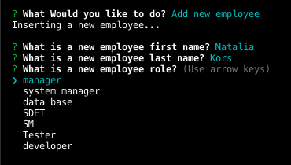
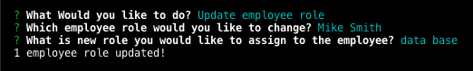

# EmployeeMngSystem

## Description
This Application called Employee Management System that can be used to managing a company's employees. This application will use an node, inquirer, and MySQL.

## Table of Contents
* [Features](#features)
* [Installation](#installation)
* [Known Bugs](#known-bugs)
* [Support](#support)
* [Technologies Used](#technologies-used)
* [Contribution Guidlines](#contribution-guidlines)
* [License](#license)

## Features
* Add new employee

* Add new department

* Add new role

* View all employees

* View all departments

* View all roles

* View all employees by roles

* View all employees by departments

* Update employee role

* End application

## Installation 
* Clone this repository.
https://github.com/NataliaSozontova/homework12EmployeeMngSystem

## Tests

* There are no tests yet for this application

## Known Bugs
* Delete departments, roles, and employees
 has not been implimented yet

* Update employee manager has not been emplimented yet

## Support
Please email me for further questions at nasozontova@gmail.com

## Technologies Used
NodeJS
JavaScript
Inquirer
MySQL

## Contribution Guidlines
Direct link to repository: https://github.com/NataliaSozontova/week11NoteTaker

## License
Copyright(c) 2021 Natalia Sozontova.